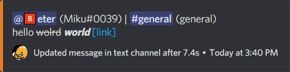
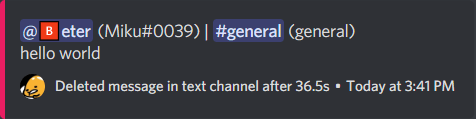
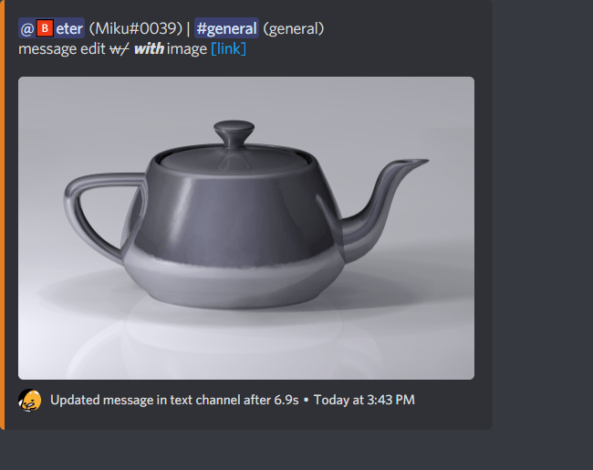
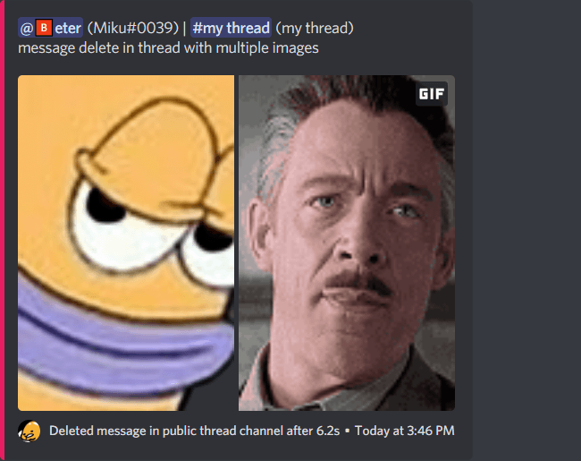
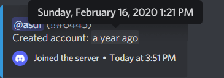
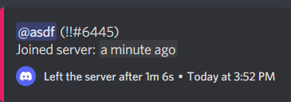
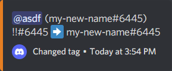
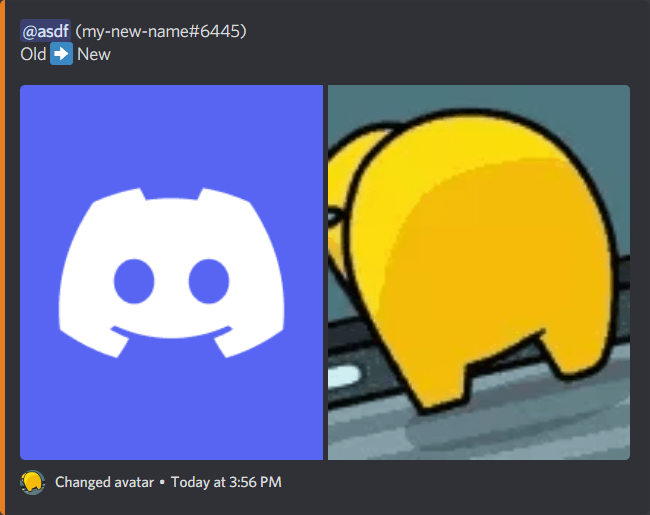

# Discord Audit Log Bot

[](https://discord.gg/WjEFnzC) [](https://twitter.com/peterthehan)

A Discord bot that fills in the gaps in Discord's Audit Log.

|                                                                              |                                                                                                     |
| :--------------------------------------------------------------------------: | :-------------------------------------------------------------------------------------------------: |
|          <p>Message edit</p>          |                     <p>Message delete</p>                    |
|  <p>Message edit with image</p> |  <p>Message delete in thread with multiple images</p> |
|            <p>Member join</p>            |                       <p>Member leave</p>                      |
|             <p>Tag change</p>             |                      <p>Avatar change</p>                     |

## Setup

1. Follow the instructions in [create-discord-bot](https://github.com/peterthehan/create-discord-bot).

   > Don't forget to give your bot the `Manage Webhooks` permission!

2. Download this bot and move the `src-discord-audit-log-bot` folder into the [/src/bots](https://github.com/peterthehan/create-discord-bot/tree/master/src/bots) folder from step 1.

   > Run `npm i diff@^5.0.0` to install this bot's dependencies.

3. Open [config.json](./src-discord-audit-log-bot/config.json) to configure your own settings:

   ```json
   [
     {
       "defaultColor": "BLURPLE",
       "positiveColor": "#3498DB",
       "neutralColor": "#E67E22",
       "negativeColor": "#E91E63",
       "deleteTimeThreshold": 1,
       "updateTimeThreshold": 0,
       "guildId": "258167954913361930",
       "logChannelId": "560648403709591552",
       "ignoreChannelIds": ["649020657522180128"]
     }
   ]
   ```

   Add as many rules as you want to configure for other servers.

   - `defaultColor`, `positiveColor`, `neutralColor`, and `negativeColor` are used to color code log embeds by the action taken.
   - `deleteTimeThreshold` and `updateTimeThreshold` (in seconds) determine if message deletes or updates will be logged or not.
   - `guildId` is the server id.
   - `logChannelId` is the channel the bot logs into.
   - `ignoreChannelIds` is a list of channel ids that the bot ignores for logging, e.g. hidden admin-only channels, read-only information channels, etc.

4. `npm start` to run the bot.

Visit for more help or information!

<a href="https://discord.gg/WjEFnzC">
  
</a>
